<div align="center">



# Awesome Telecom Business Support System (BSS) 📡 💳 ⚡

**A curated directory of top-tier SaaS platforms, enterprise charging suites, and open-source engines powering modern Communications Service Providers (CSPs), MVNOs, 5G Operators, and Digital Telcos.**

<p align="center">
  <a href="https://github.com/ishandutta2007/Awesome-Awesome-Awesome"></a><a href="https://discord.gg/jc4xtF58Ve"></a>
  <a href="https://github.com/ishandutta2007/Awesome-Telecom-Business-Support-System/stargazers"></a>
  <a href="https://github.com/ishandutta2007/Awesome-Telecom-Business-Support-System/network/members"></a>
  <a href="https://github.com/ishandutta2007/Awesome-Telecom-Business-Support-System/pulls"></a>
  <a href="https://github.com/ishandutta2007/Awesome-Telecom-Business-Support-System/blob/main/LICENSE"></a>
  <a href="https://github.com/ishandutta2007"></a>
</p>

---

*Curated list of telecom billing, 3GPP Online Charging Systems (OCS), 5G Converged Charging Function (CHF), CDR mediation pipelines, customer care (CRM), enterprise product catalog (EPC), and revenue operations platforms.*

**Last updated: August 2026** 🌐

</div>

---

## 📑 Table of Contents
- [📌 Overview & Industry Architecture](#-overview--industry-architecture)
- [☁️ SaaS & Hosted BSS Platforms](#️-saas--hosted-bss-platforms)
- [💻 Open-Source Telecom BSS & Charging Projects](#-open-source-telecom-bss--charging-projects)
- [🏗️ Architectural Blueprint & Custom Stacks](#️-architectural-blueprint--custom-stacks)
- [📈 Star History](#-star-history)
- [🤝 How to Contribute](#-how-to-contribute)
- [⚖️ Disclaimer & Standards](#️-disclaimer--standards)

---

## 📌 Overview & Industry Architecture

A **Telecom Business Support System (BSS)** manages the commercial, financial, customer-facing, and revenue-generating functions of a telecommunications network. Working hand-in-hand with Operations Support Systems (OSS), BSS platforms drive:

- **Convergent Charging (OCS / CCS / CHF)**: Real-time credit control and multi-service rating over 3GPP Diameter (Gy/Ro/Rf) and 5G HTTP/2 Service-Based Architecture (Nchf).
- **Billing & Invoicing**: Postpaid cycle billing, prepaid balance lifecycle, hybrid accounts, split billing, multi-currency invoicing, and automated collection workflows.
- **Enterprise Product Catalog (EPC)**: Unified offer design, tariff configuration, bundling, discounting, and TM Forum Open API alignment (TMF620).
- **CDR Mediation & Rating**: High-throughput collection, normalization, validation, and enrichment of Call Detail Records (CDRs), IPDRs, and event logs.
- **Customer Relationship Management (CRM) & Self-Care**: Subscriber onboarding, eSIM provisioning orchestration, loyalty programs, and omni-channel self-service.

---

## ☁️ SaaS & Hosted BSS Platforms

> 📊 **Market Size & Industry Dynamics**: The global Telecom Business Support Systems (BSS) market is valued at approximately **$6.8 Billion – $8.5 Billion** and is projected to reach **$12.5+ Billion** by 2030 at an **11.8% CAGR**. The industry is **moderately concentrated** at the Tier-1 mobile network operator (MNO) level—anchored by established global tech conglomerates (Oracle, Huawei, Ericsson, Amdocs, CSG)—while exhibiting **rapidly accelerating fragmentation** across MVNOs, sub-brands, private 5G networks, and IoT services driven by cloud-native SaaS disruptors and open-core engines.

*The table below compares notable hosted and cloud-native Telecom BSS solutions, sorted in descending order by company scale (valuation / annual revenue).*

| Product / Platform | Primary Focus & Description | Company Valuation / Annual Revenue | Starting Pricing | Free Tier / Free Trial Limits |
| :--- | :--- | :--- | :--- | :--- |
| **[Oracle Communications Billing (BRM)](https://www.oracle.com/industries/communications/)** | Cloud-deployed Billing and Revenue Management suite for complex rating, policy, and multi-play CSPs. | **~$480B Valuation** (Market Cap) / ~$53B Annual Revenue | $2,500 / month (OCI base managed entry tier + $0.05/active subscriber) | 30-day free trial with $300 Oracle Cloud Infrastructure (OCI) credits to deploy and evaluate BRM/BSS components |
| **[Huawei CBS](https://www.huawei.com/)** | Convergent Billing System deployed globally for high-throughput prepaid/postpaid charging and subscriber management. | **~$100B Annual Revenue** (Global Telecom & Network Giant) | $40,000 / month (Managed cloud carrier starting tier) | 30-day lab proof-of-concept environment for carrier rating and charging validation |
| **[Ericsson Charging](https://www.ericsson.com/)** | 3GPP-compliant converged charging system (CCS) and monetization portfolio for 5G, IoT, and hybrid CSPs. | **~$22B Valuation** (Market Cap) / ~$25B Annual Revenue | $35,000 / month (Managed cloud BSS entry base tier) | 30-day partner lab environment sandbox access for 5G charging API and rating scenario validation |
| **[Amdocs BSS / connectX](https://www.amdocs.com/)** | Market-leading end-to-end cloud BSS suite for Tier-1 CSPs and MVNOs (charging, catalog, care, billing). | **~$10.5B Valuation** (Market Cap) / ~$4.9B Annual Revenue | $25,000 / month (connectX / SaaS entry-level subscription tier) | 30-day structured PoC sandbox trial via AWS Marketplace / telco partner program |
| **[CSG Ascendon](https://www.csgi.com/)** | Digital BSS and high-velocity revenue management platform for multi-brand telcos and MVNOs on AWS/Azure. | **~$1.8B Valuation** (Market Cap) / ~$1.2B Annual Revenue | $15,000 / month (Base SaaS platform tier) | 30-day enterprise sandbox and proof-of-concept testing environment for verified telco operators |
| **[Enghouse Networks BSS](https://www.enghouse.com/)** | Cloud billing, interconnect billing, customer care, and revenue assurance for regional CSPs and ISPs. | **~$1.2B Valuation** (Market Cap) / ~$450M Annual Revenue | $5,000 / month (Cloud billing starting tier) | 30-day evaluation trial including guided demo tenant and sample CDR rating batch testing |
| **[Netcracker Digital BSS](https://www.netcracker.com/)** | Full-stack digital BSS platform for convergent charging, partner ecosystem, and digital customer journeys. | **~$1.1B Annual Revenue** (Subsidiary of NEC Corp, ~$18B Market Cap) | $30,000 / month (Entry managed SaaS subscription tier) | 60-day structured Proof-of-Concept (PoC) evaluation in a dedicated cloud carrier sandbox |
| **[Cerillion Skyline](https://www.cerillion.com/)** | Cloud-native SaaS subscription billing, rating, and customer lifecycle management system. | **~$550M Valuation** (Market Cap) / ~$55M Annual Revenue | $140 / month (Skyline Essential starting tier) | 7-day free trial with access to billing configuration engine, sample catalogs, and API endpoints |
| **[Matrixx Software](https://www.matrixx.com/)** | Real-time 5G convergent charging and digital commerce platform for cloud-native network monetization. | **~$450M Valuation** / ~$60M Annual Revenue | $20,000 / month (Core cloud charging entry tier) | 30-day lab sandbox access with up to 10,000 simulated subscribers for performance evaluation |
| **[Openet (Amdocs)](https://www.openet.com/)** | Real-time policy, charging (CHF), and data monetization SaaS suite for 4G/5G standalone networks. | **~$180M Acquisition Value** / ~$70M Annual Revenue | $18,000 / month (Cloud-native policy/charging gateway starting tier) | 30-day sandbox pilot access for Diameter and 5G HTTP/2 Service-Based Architecture (SBA) validation |
| **[Optiva BSS](https://www.optiva.com/)** | Cloud-native charging and BSS suite deployed as SaaS on Google Cloud for digital telcos and MVNO Hubs. | **~$120M Valuation** (Market Cap) / ~$65M Annual Revenue | $10,000 / month (MVNO Hubs base platform tier) | 30-day guided pilot & proof-of-concept sandbox for MVNO and digital telco architecture evaluation |
| **[Lago Cloud](https://www.getlago.com/)** | Real-time usage-based billing, metering, and invoicing engine for digital telcos and API services. | **~$80M Valuation** (Venture-Backed Tier) | $250 / month (Pro Cloud tier) | **Free forever** open-source self-hosted edition (unlimited events) or 14-day free trial on Cloud Pro |
| **[Totogi BSS & Charging](https://totogi.com/)** | Cloud-native multi-tenant SaaS OCS and BSS built natively on AWS for digital telcos and MVNOs. | **~$70M Valuation** (Telco SaaS Disruptor) | $0.05 / 10,000 transactions (Pay-as-you-go above free tier) | **Free forever** up to 500 million transactions/mo (Charging) & 500 million API calls/mo (BSS) for ≤250,000 subscribers |
| **[LogiSense](https://www.logisense.com/)** | Agile subscription, telecom usage rating, and mediation platform for VoIP, IoT, and enterprise CSPs. | **~$50M Valuation** / ~$15M Annual Revenue | $1,000 / month (Starter deployment tier) | 30-day free trial with 24/7 sandbox access, rating simulation templates, and onboarding orientation |
| **[PortaOne (PortaSwitch / PortaBilling)](https://portaone.com/)** | Multi-tenant cloud-hosted convergent BSS/OCS for Class 4/5 SIP routing, MVNOs, and fixed-line telcos. | **~$40M Valuation** / ~$12M Annual Revenue | $12,500 / month ($150,000/yr starting base tier deployment) | 30-day free trial for Add-on Mart extension modules with full integration sandbox on test instances |
| **[Kill Bill (AWS Cloud)](https://killbill.io/)** | Enterprise subscription billing and payment management architecture running on cloud infrastructure. | **~$30M Valuation** (Open Core Ecosystem) | $40 / month (Base AMI software subscription fee) | **Free forever** open-core self-hosted edition or 14-day free trial via AWS Marketplace listing |

---

## 💻 Open-Source Telecom BSS & Charging Projects

*Telecom BSS and OCS boast one of the most resilient open-source ecosystems. The repositories below are sorted in descending order by GitHub Stars.*

1. **[Lago](https://github.com/getlago/lago)** [](https://github.com/getlago/lago/stargazers) ⚡  
   Open-source usage-based billing, real-time metering, and automated invoicing platform. Built for modern developer workflows, digital telcos, APIs, and consumption-based telecom service pricing. AGPL-3.0 licensed.

2. **[Kill Bill](https://github.com/killbill/killbill)** [](https://github.com/killbill/killbill/stargazers) 💳  
   Leading open-source subscription billing and payment management platform with modular plugin architecture. Widely used for complex multi-tenant billing, payment gateway integration, and hybrid telecom subscription models. Apache-2.0 licensed.

3. **[Open5GS](https://github.com/open5gs/open5gs)** [](https://github.com/open5gs/open5gs/stargazers) 📡  
   C-language implementation of 5G Core (5GC) and 4G EPC network functions. Features built-in 3GPP-compliant Converged Charging Function (CHF) support, Diameter (Gy/Ro/Rf), and Service-Based Interface (SBI) rating pipelines. AGPL-3.0 licensed.

4. **[free5GC](https://github.com/free5gc/free5gc)** [](https://github.com/free5gc/free5gc/stargazers) 🌐  
   Open-source 3GPP Release 15/16 compliant 5G core network in Go. Includes modular microservice functions for policy control (PCF), session management (SMF), and charging function (CHF) integration for 5G network slicing monetization. Apache-2.0 licensed.

5. **[FOSSBilling](https://github.com/FOSSBilling/FOSSBilling)** [](https://github.com/FOSSBilling/FOSSBilling/stargazers) 🛠️  
   Community-driven, lightweight billing and client management system. Provides client onboarding, automated invoicing, ticketing, and modular extensions adaptable for ISPs, cloud hosting, and voice resellers. Apache-2.0 licensed.

6. **[CGRateS](https://github.com/cgrates/cgrates)** [](https://github.com/cgrates/cgrates/stargazers) 🚀  
   High-performance, carrier-grade Online/Offline Charging System (OCS) written in Go. Provides real-time rating, multi-balance management, session/event charging, CDR mediation, Least Cost Routing (LCR), fraud detection, and multi-tenant microservices. AGPL-3.0 licensed.

7. **[ASTPP](https://github.com/inextrix/ASTPP)** [](https://github.com/inextrix/ASTPP/stargazers) 📞  
   Open-source VoIP billing and customer management solution for FreeSWITCH and Asterisk. Features multi-tenant billing, calling cards, rate engines, DID management, invoice generation, and customer web portals. GPL-3.0 licensed.

8. **[Osmocom Libosmocore](https://github.com/osmocom/libosmocore)** [](https://github.com/osmocom/libosmocore/stargazers) 🛰️  
   Core software library collection powering the Open Source Mobile Communications (Osmocom) ecosystem, providing GSM/GPRS/3G protocol stacks, subscriber balance tracking, and radio network mediation primitives. GPL-2.0 licensed.

9. **[SigScale OCS](https://github.com/sigscale/ocs)** [](https://github.com/sigscale/ocs/stargazers) 🛡️  
   Carrier-grade Erlang/OTP Online Charging System implementing 3GPP 32.296 standards. Supports Diameter Credit-Control Application (DCCA / RFC 4006 / Gy / Ro), RADIUS charging, and TM Forum Open API REST integration. Apache-2.0 licensed.

10. **[BillRun](https://github.com/BillRun/system)** [](https://github.com/BillRun/system/stargazers) 📊  
    Open-source enterprise billing and mediation suite designed for telecom operators, IoT platforms, and utility providers. Handles large-volume CDR mediation, multi-dimensional pricing, convergent invoicing, and CRM integrations. AGPL-3.0 licensed.

11. **[freeDiameter](https://github.com/freeDiameter/freeDiameter)** [](https://github.com/freeDiameter/freeDiameter/stargazers) 🔌  
    C implementation of the Diameter Base Protocol (RFC 6733 / RFC 3588) and extensions (RFC 4006 Credit-Control, EAP, SIP). Critical plumbing component used across telecom OCS/PCRF charging architectures. BSD-3-Clause licensed.

12. **[Ostelco Core](https://github.com/ostelco/ostelco-core)** [](https://github.com/ostelco/ostelco-core/stargazers) ☁️  
    Cloud-native telco BSS/OCS platform built with gRPC, Diameter gateways, rule engines, and real-time streaming analytics tailored for mobile packet-data services. Apache-2.0 licensed.

13. **[CDRTool](https://github.com/AGProjects/cdrtool)** [](https://github.com/AGProjects/cdrtool/stargazers) 📑  
    High-volume CDR mediation, rating engine, and prepaid account management tool for OpenSIPS and Asterisk voice architectures. GPL-2.0 licensed.

---

## 🏗️ Architectural Blueprint & Custom Stacks

```
  +-------------------------------------------------------------------+
  |               Digital Touchpoints & Customer Portals              |
  |         (eSIM Onboarding, Self-Care Mobile Apps, Web CRM)         |
  +---------------------------------+---------------------------------+
                                    | TM Forum Open APIs (TMF620/622)
  +---------------------------------v---------------------------------+
  |                  BSS Product Catalog & Order Engine               |
  |             (Tariff Plans, Bundles, Subscriptions, SIMs)          |
  +---------------------------------+---------------------------------+
                                    | Rating / Credit Inquiries
  +---------------------------------v---------------------------------+
  |             Real-Time Convergent Charging System (OCS)            |
  |         [ CGRateS / SigScale OCS / Open5GS CHF / Totogi ]         |
  +--------+------------------------+------------------------+--------+
           | 3GPP Gy/Ro             | 5G Nchf SBI            | CDR Ingestion
  +--------v--------+      +--------v--------+      +--------v--------+
  | 4G EPC (PGW/PCEF) |      | 5G Core (SMF/UPF) |      | CDR Mediation   |
  | Diameter DCCA   |      | HTTP/2 JSON     |      | (Kafka/BillRun) |
  +-----------------+      +-----------------+      +-----------------+
```

### 💡 Building Modern Telco Stacks:
- **Core Real-Time Rating**: Deploy **CGRateS** or **SigScale OCS** to handle sub-millisecond Diameter credit-control requests from PGW/SMF nodes.
- **Mediation & Stream Processing**: Stream offline CDRs through **Apache Kafka** or **Apache Flink** into **BillRun** for batched rating and tax calculation.
- **Subscription & Invoicing**: Combine **Lago** or **Kill Bill** for recurring fee scheduling, digital wallet balances, and automated payment gateway settlement (Stripe, Adyen).
- **Standards Compliance**: Expose customer and catalog endpoints adhering to **TM Forum Open API standards** to guarantee modular vendor interoperability.

---

## 📈 Star History

[](https://star-history.dera.page/#ishandutta2007/Awesome-Telecom-Business-Support-System&type=date&legend=top-left)

---

## 🤝 How to Contribute

Contributions are warmly welcomed to keep this ecosystem directory comprehensive and up-to-date!

1. 🍴 **Fork the repository**.
2. 🌿 **Create a descriptive feature branch** (`git checkout -b add-my-bss-tool`).
3. 📝 **Add your entry** adhering to the tabular SaaS format or sorted open-source schema.
4. 🔍 **Verify links and metrics** (ensure exact starting prices, free tier limits, and valid GitHub links).
5. 🚀 **Submit a Pull Request** with a brief summary of the project.

---

## ⚖️ Disclaimer & Standards

- This repository is a **community-curated index** for educational and architectural reference purposes.
- Telecom BSS architectures manage mission-critical billing records, fiscal compliance, tax obligations, and consumer privacy (GDPR, CPNI). Rigorous staging tests, audit reconciliation, and regulatory validation are recommended before deploying any stack to production.

---

<div align="center">

**Maintained with ❤️ by the Telecom & Open-Source Billing Community.**  
*Empowering MVNOs, 5G Innovators, and Telco Engineers with Open & Scalable Monetization.*

</div>